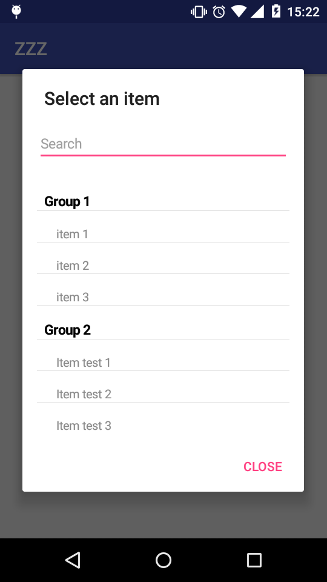

# SpinnerSearch
library doing research in spinner.
</br>
</br>


# Requirements
SpinnerSearch requires at minimum Android 4.1 (API level 16).
</br>
</br>


# Gradle Dependency

## Repository
The Gradle dependency is available via Maven. Maven is the default Maven repository used by Android Studio.
</br>

## Add repository
<pre><code>
repositories {
    maven {
          url  "https://dl.bintray.com/rod120/SpinnerSearch"
          }
}
</code></pre>


## Add dependency

#### Gradle:
<pre><code>
    compile 'com.github.rodlibs:spinnerSearch:1.0'
</code></pre>


#### Maven:
```xml
 <dependency>
  <groupId>com.github.rodlibs</groupId>
  <artifactId>spinnerSearch</artifactId>
  <version>1.0</version>
  <type>pom</type>
</dependency>
```
</br>
</br>


# Sample usage
#### .java

###### Create a list with the List object in the Group and Item pattern. Then add the list of items and context within SpinnerSearch.
<pre><code>
        List<Item> listItem = new ArrayList<>();
        listItem.add(new Item("Group 1","item 1"));
        listItem.add(new Item("Group 1","item 2"));
        listItem.add(new Item("Group 1","item 3"));
        listItem.add(new Item("Group 2","Item test 1"));
        listItem.add(new Item("Group 2","Item test 2"));
        listItem.add(new Item("Group 2","Item test 3"));
        listItem.add(new Item("Group 3","item 1"));
        listItem.add(new Item("Group 3","item 2"));
        listItem.add(new Item("Group 3","item 3"));


        SpinnerSearch spinner = new SpinnerSearch(MainActivity.this,listItem);
</code></pre>


###### Listener that returns the selected item.
<pre><code>
    spinner.setOnItemClickListener(new OnItemClickListener() {
            @Override
            public void onItemClick(int i, Item item) {
            }
        });
</code></pre>


###### Displayed the component.
<pre><code>
    spinner.show();
</code></pre>


#### .kt

###### Create a list with the List object in the Group and Item pattern. Then add the list of items and context within SpinnerSearch.
<pre><code>
        var listItem = mutableListOf<Item>()
        listItem.add(Item("Group 1", "item 1"))
        listItem.add(Item("Group 1", "item 2"))
        listItem.add(Item("Group 1", "item 3"))
        listItem.add(Item("Group 2", "Item test 1"))
        listItem.add(Item("Group 2", "Item test 2"))
        listItem.add(Item("Group 2", "Item test 3"))
        listItem.add(Item("Group 3", "item 1"))
        listItem.add(Item("Group 3", "item 2"))
        listItem.add(Item("Group 3", "item 3"))
        
        
        var spinner: SpinnerSearch? = SpinnerSearch(this@MainActivity, listItem)
  
</code></pre>


###### Listener that returns the selected item.
<pre><code>
         spinner?.setOnItemClickListener(OnItemClickListener {
            i, item -> 
            })
</code></pre>


###### Displayed the component.
<pre><code>
        spinner?.show()
</code></pre>
</br>


# Api Methods
<pre><code>
  setTitleMessage(String title)  -->> set title dialog.
</code></pre>

<pre><code>
  setTitleButtonMessage(String title)  -->> set the dialog close button name.
</code></pre>

<pre><code>
  setCancelable(boolean flag)  -->> closes the dialog when playing outside the component.
</code></pre>

<pre><code>
  setGravitCampSearch(int gravity)  -->> search field position.
</code></pre>

<pre><code>
  setVisibleCampSearch(int visible)  -->> set search field visibility.
</code></pre>

<pre><code>
  setTextSizeSearch(float size)  -->> set search field text size.
</code></pre>

<pre><code>
  setTextHintSearch(String hint)  -->> search field hint text.
</code></pre>

<pre><code>
  setColortextSearch(int color)  -->> search field color text.
</code></pre>

<pre><code>
  setTypefaceSearch(Typeface type) -->> search field Typeface text.
</code></pre>

<pre><code>
  setDividerHeigth(int heigth) -->> defined the thickness of the dividing line of the list.
</code></pre>

<pre><code>
  setSizeFontGroupList(float size) -->> set the font size of groups.
</code></pre>

<pre><code>
  setSizeFontItemList(float size) -->> set the font size of itens.
</code></pre>

<pre><code>
  setColorFontGroupList(int color) -->> set the color text of groups.
</code></pre>

<pre><code>
  setColorFontItemList(int color) -->> set the color text of itens.
</code></pre>

<pre><code>
  setTypefaceGroupList(Typeface type) -->> set the Typeface text of groups.
</code></pre>

<pre><code>
  setTypefaceItemList(Typeface type) -->> set the Typeface text of itens.
</code></pre>

<pre><code>
  show() -->> Displayed the component.
</code></pre>
</br>


# License
<pre><code>
Licensed under the Apache License, Version 2.0 (the "License");
you may not use this file except in compliance with the License.
You may obtain a copy of the License at

   http://www.apache.org/licenses/LICENSE-2.0

Unless required by applicable law or agreed to in writing, software
distributed under the License is distributed on an "AS IS" BASIS,
WITHOUT WARRANTIES OR CONDITIONS OF ANY KIND, either express or implied.
See the License for the specific language governing permissions and
limitations under the License.
</code></pre>

